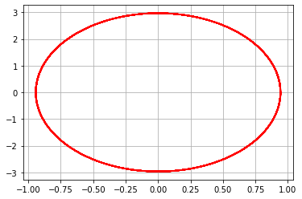
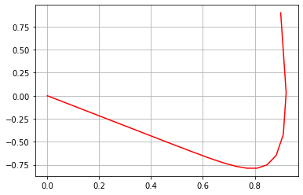
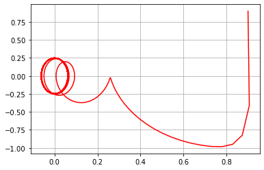

---
## Front matter
lang: ru-RU
title: Лабораторная работа №4
author: Левкович Константин Анатольевич\inst{1}
institute: 	\inst{1}RUDN University, Moscow, Russian Federation
date: RUDN University, 27 February, 2021 Moscow, Russia

## Formatting
toc: false
slide_level: 2
theme: metropolis
header-includes: 
 - \metroset{progressbar=frametitle,sectionpage=progressbar,numbering=fraction}
 - '\makeatletter'
 - '\beamer@ignorenonframefalse'
 - '\makeatother'
aspectratio: 43
section-titles: true
---
# Цель лабораторной работы

## Цель лабораторной работы

- Научиться строить модели гармонических колебаний на примере линейного гармонического осциллятора.
- Построить фазовый портрет гармонического осциллятора
- Решить уравнения гармонического осциллятора

# Задача

## Задача

Построить фазовый портрет гармонического осциллятора и решение уравнения гармонического осциллятора для следующих случаев
1. Колебания гармонического осциллятора без затуханий и без действий внешней силы $\ddot {x} + 9.9x = 0$
2. Колебания гармонического осциллятора c затуханием и без действий внешней силы $\ddot {x} + 13 \dot {x} + 13x = 0$
3. Колебания гармонического осциллятора c затуханием и под действием внешней силы $\ddot {x} + 24 \dot {x} + 25x = 6sin(4t)$

На интервале $t \in [0; 48]$(шаг 0.05) с начальными условиями $x_0 = 0.9, y_0 = 0.9$

# Результаты выполнения лабораторной работы

## Ход выполнения работы

1. Описал функцию вектор функции $f(t, x)$ для решения дифференциальных уравнений $\dot {x} = y(t, x)$, где $x$ - искомый вектор.

2. Написал функцию для правой части уравнения $f(t)$. 

3. Написал основную функцию для построения модели: задал вектор начальных условий, интервал для решения задачи, использовал библиотеку scipy для решения дифференциального уравнения, а также matplotlib для построения графиков.

## Полученные графики

{ #fig:001 width=70% }

## Полученные графики

{ #fig:002 width=70% }

## Полученные графики

{ #fig:003 width=70% }

# Вопросы

## Запишите простейшую модель гармонических колебаний

$x = x_m cos (ωt + φ0)$ - простейшая модель гармонических колебаний. 
    

## Дайте определение осциллятора

Осциллятор - модель, которую в теории колебаний можно описать одним и тем же дифференциальным уравнением.

## Запишите модель математического маятника

Уравнение динамики принимает вид: $$\frac{d^2 \alpha}{d t^2} + \frac{g}{L} sin{\alpha} = 0$$ В случае малых колебаний полагают $sin{\alpha} ≈ \alpha$. В результате возникает линейное дифференциальное уравнение $$\frac{d^2 \alpha}{d t^2} + \frac{g}{L} \alpha = 0$$ или $$\frac{d^2 \alpha}{d t^2} + \omega^2 \alpha = 0$$

## Запишите алгоритм перехода от дифференциального уравнения второго порядка к двум дифференциальным уравнениям первого порядка

Пусть у нас есть дифференциальное уравнение 2-го порядка:
$$ \ddot {y} + 4y = cos(3x), y(0)=0.8, \dot {y}(0)=2  $$

По методу Ранге-Кутты делаем замену, а также переносим 4$y$ в правую часть:
$$ \dot {y} = z $$

Тогда получим систему уравнений:
    $$ 
            \begin{cases}
                \dot {y} = z = g(x, y, z)
                \\ 
                \dot{z} = cos(3x) - 4y = f(x, y, z)
             \end{cases}
    $$
    
## Что такое фазовый портрет и фазовая траектория?

Фазовый портрет — это совокупность фазовых траекторий для всевозможных начальных условий.

Фазовая траектория — траектория движения изображающей точки, сопоставленной изменению состояний системы.

## {.standout}

Спасибо за внимание!