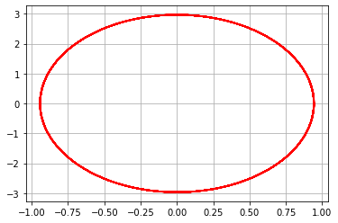
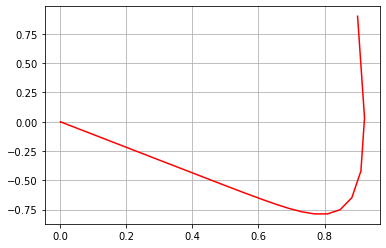
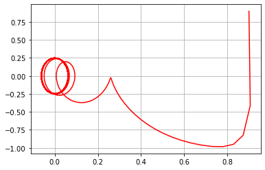

---
# Front matter
lang: ru-RU
title: "Лабораторная работа №4"
subtitle: "Модель гармонических колебаний"
author: "Левкович Константин Анатольевич"

# Formatting
toc-title: "Содержание"
toc: true # Table of contents
toc_depth: 2
lof: true # List of figures
lot: true # List of tables
fontsize: 12pt
linestretch: 1.5
papersize: a4paper
documentclass: scrreprt
polyglossia-lang: russian
polyglossia-otherlangs: english
mainfont: PT Serif
romanfont: PT Serif
sansfont: PT Sans
monofont: PT Mono
mainfontoptions: Ligatures=TeX
romanfontoptions: Ligatures=TeX
sansfontoptions: Ligatures=TeX,Scale=MatchLowercase
monofontoptions: Scale=MatchLowercase
indent: true
pdf-engine: lualatex
header-includes:
  - \linepenalty=10 # the penalty added to the badness of each line within a paragraph (no associated penalty node) Increasing the value makes tex try to have fewer lines in the paragraph.
  - \interlinepenalty=0 # value of the penalty (node) added after each line of a paragraph.
  - \hyphenpenalty=50 # the penalty for line breaking at an automatically inserted hyphen
  - \exhyphenpenalty=50 # the penalty for line breaking at an explicit hyphen
  - \binoppenalty=700 # the penalty for breaking a line at a binary operator
  - \relpenalty=500 # the penalty for breaking a line at a relation
  - \clubpenalty=150 # extra penalty for breaking after first line of a paragraph
  - \widowpenalty=150 # extra penalty for breaking before last line of a paragraph
  - \displaywidowpenalty=50 # extra penalty for breaking before last line before a display math
  - \brokenpenalty=100 # extra penalty for page breaking after a hyphenated line
  - \predisplaypenalty=10000 # penalty for breaking before a display
  - \postdisplaypenalty=0 # penalty for breaking after a display
  - \floatingpenalty = 20000 # penalty for splitting an insertion (can only be split footnote in standard LaTeX)
  - \raggedbottom # or \flushbottom
  - \usepackage{float} # keep figures where there are in the text
  - \floatplacement{figure}{H} # keep figures where there are in the text
---

# Цель работы

Научиться строить модели гармонических колебаний на примере линейного гармонического осциллятора.
Построить фазовый портрет гармонического осциллятора
Решить уравнения гармонического осциллятора

# Задание 

Построить фазовый портрет гармонического осциллятора и решение уравнения гармонического осциллятора для следующих случаев
1. Колебания гармонического осциллятора без затуханий и без действий внешней силы $\ddot {x} + 9.9x = 0$
2. Колебания гармонического осциллятора c затуханием и без действий внешней силы $\ddot {x} + 13 \dot {x} + 13x = 0$
3. Колебания гармонического осциллятора c затуханием и под действием внешней силы $\ddot {x} + 24 \dot {x} + 25x = 6sin(4t)$

На интервале $t \in [0; 48]$(шаг 0.05) с начальными условиями $x_0 = 0.9, y_0 = 0.9$

# Выполнение лабораторной работы

## Теоретическое введение

   Уравнение свободных колебаний гармонического осциллятора имеет следующий вид:

$$ \ddot {x} + 2 \gamma \dot {x} + w_0^2x = f(t) $$

$x$ — переменная, описывающая состояние системы (смещение грузика, заряд конденсатора и т.д.)

$t$ — время

$w$ — частота

$\gamma$ — затухание

   Обозначения:

$$ \ddot{x} = \frac{\partial^2 x}{\partial t^2}, \dot{x} = \frac{\partial x}{\partial t}$$

   При отсутствии потерь в системе получаем уравнение консервативного осциллятора, энергия колебания которого сохраняется во времени:

$$ \ddot {x} + w_0^2x = 0 $$

   Для однозначной разрешимости уравнения второго порядка необходимо задать два начальных условия вида:

$$ \begin{cases} x(t_0) = x_0 \\ \dot{x}(t_0) = y_0 \end{cases} $$

   Уравнение второго порядка можно представить в виде системы двух уравнений первого порядка:

$$ \begin{cases} \dot{x} = y \\ \dot{y} = -w_0^2x \end{cases} $$

   Начальные условия для системы примут вид:

$$ \begin{cases} x(t_0) = x_0 \\ y(t_0) = y_0 \end{cases} $$

   Независимые переменные x, y определяют пространство, в котором «движется» решение. Это фазовое пространство системы, поскольку оно двумерно будем называть его фазовой плоскостью.
   
   Значение фазовых координат x, y в любой момент времени полностью определяет состояние системы. Решению уравнения движения как функции времени отвечает гладкая кривая в фазовой плоскости. Она называется фазовой траекторией. Если множество различных решений (соответствующих различным начальным условиям) изобразить на одной фазовой плоскости, возникает общая картина поведения системы. Такую картину, образованную набором фазовых траекторий, называют фазовым портретом.

## Ход выполнения 

1. Описал функцию вектор функции $f(t, x)$ для решения дифференциальных уравнений $\dot {x} = y(t, x)$, где $x$ - искомый вектор.

2. Написал функцию для правой части уравнения $f(t)$. 

3. Написал основную функцию для построения модели: задал вектор начальных условий, интервал для решения задачи, использовал библиотеку scipy для решения дифференциального уравнения, а также matplotlib для построения графиков.

## Графики

График первого случая. Колебания гармонического осциллятора без затуханий и без действий внешней силы $\ddot {x} + 9.9x = 0$ (рис. -@fig:001)

{ #fig:001 width=70% }

График второго случая. Колебания гармонического осциллятора c затуханием и без действий внешней силы $\ddot {x} + 13 \dot {x} + 13x = 0$ (рис. -@fig:002)

{ #fig:002 width=70% }

График третьего случая. Колебания гармонического осциллятора c затуханием и под действием внешней силы $\ddot {x} + 24 \dot {x} + 25x = 6sin(4t)$ (рис. -@fig:003)

{ #fig:003 width=70% }

## Ответы на вопросы

### Запишите простейшую модель гармонических колебаний
$x = x_m cos (ωt + φ0)$ - простейшая модель гармонических колебаний. 
    

### Дайте определение осциллятора
Осциллятор - модель, которую в теории колебаний можно описать одним и тем же дифференциальным уравнением.

### Запишите модель математического маятника

Уравнение динамики принимает вид: $$\frac{d^2 \alpha}{d t^2} + \frac{g}{L} sin{\alpha} = 0$$ В случае малых колебаний полагают $sin{\alpha} ≈ \alpha$. В результате возникает линейное дифференциальное уравнение $$\frac{d^2 \alpha}{d t^2} + \frac{g}{L} \alpha = 0$$ или $$\frac{d^2 \alpha}{d t^2} + \omega^2 \alpha = 0$$

### Запишите алгоритм перехода от дифференциального уравнения второго порядка к двум дифференциальным уравнениям первого порядка
Пусть у нас есть дифференциальное уравнение 2-го порядка:
$$ \ddot {y} + 4y = cos(3x), y(0)=0.8, \dot {y}(0)=2  $$

По методу Ранге-Кутты делаем замену, а также переносим 4$y$ в правую часть:
$$ \dot {y} = z $$

Тогда получим систему уравнений:
    $$ 
            \begin{cases}
                \dot {y} = z = g(x, y, z)
                \\ 
                \dot{z} = cos(3x) - 4y = f(x, y, z)
             \end{cases}
    $$
    
### Что такое фазовый портрет и фазовая траектория?
Фазовый портрет — это совокупность фазовых траекторий для всевозможных начальных условий.

Фазовая траектория — траектория движения изображающей точки, сопоставленной изменению состояний системы.

# Выводы

Научился строить модели гармонических колебаний на примере линейного гармонического осциллятора.
Построил фазовый портрет гармонического осциллятора и решил уравнения гармонического осциллятора:
1. Колебания гармонического осциллятора без затуханий и без действий внешней силы.
2. Колебания гармонического осциллятора c затуханием и без действий внешней силы.
3. Колебания гармонического осциллятора c затуханием и под действием внешней силы.