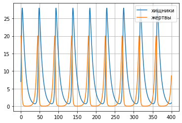
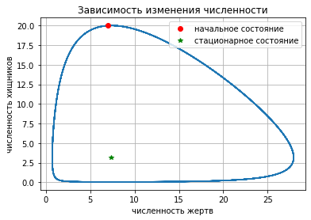

---
## Front matter
lang: ru-RU
title: Лабораторная работа №5
author: |
	Левкович К.А. - студент группы НКНбд-01-18
date: 04.03.2021

## Formatting
toc: false
slide_level: 2
theme: metropolis
header-includes: 
 - \metroset{progressbar=frametitle,sectionpage=progressbar,numbering=fraction}
 - '\makeatletter'
 - '\beamer@ignorenonframefalse'
 - '\makeatother'
aspectratio: 43
section-titles: true
---

# Модель «хищник-жертва»

## Цель выполнения лабораторной работы

- Научиться строить модели «хищник-жертва» на примере модели Лотки-Вольтерры.

## Задачи выолнения работы

- Построить график зависимости численности хищников от численности жертв, а также графики изменения численности хищников и численности жертв.
- Найти стационарное состояние системы

## Условия

$$
\begin{cases}
    \frac{\partial x}{\partial t} = -0.13x(t)+0.041x(t)y(t)
    \\
    \frac{\partial y}{\partial t} = 0.31y(t)-0.042x(t)y(t)
\end{cases}
$$

## Графики

{ #fig:001 width=70% }

## Графики

{ #fig:002 width=70% }

## Вывод

- Познакомился с моделью «хищник-жертва» на примере простейшей модели взаимодействия - модели Лотки-Вольтерры.
- Построил график зависимости $x$ от $y$ и графики функций $x(t), y(t)$ и нашел стационарное состояние.