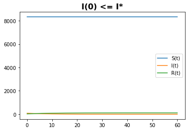
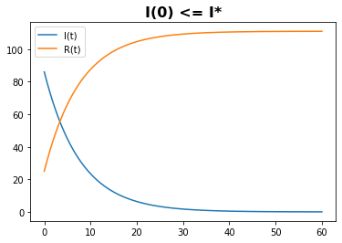
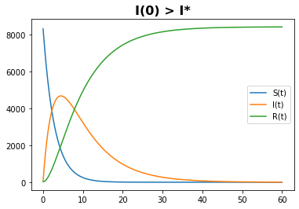

---
## Front matter
lang: ru-RU
title: Лабораторная работа №6
author: |
	Левкович К.А. - студент группы НКНбд-01-18
date: 20.03.2021

## Formatting
toc: false
slide_level: 2
theme: metropolis
header-includes: 
 - \metroset{progressbar=frametitle,sectionpage=progressbar,numbering=fraction}
 - '\makeatletter'
 - '\beamer@ignorenonframefalse'
 - '\makeatother'
aspectratio: 43
section-titles: true
---

# Задача об эпидемии

## Цель выполнения лабораторной работы

- Рассмотреть простейшую модель эпидемии.

## Задачи выполнения работы

- Построить графики изменения числа особей в каждой из трех групп.

- Расмотреть, как будет протекать эпидемия.

## Условия

На одном острове вспыхнула эпидемия. Известно, что из всех проживающих на острове $(N=8439)$ в момент начала эпидемии $(t=0)$ число заболевших людей
(являющихся распространителями инфекции) $I(0)=86$, А число здоровых людей с
иммунитетом к болезни $R(0)=25$. Таким образом, число людей восприимчивых к
болезни, но пока здоровых, в начальный момент времени $S(0)=N-I(0)- R(0)$.  
Постройте графики изменения числа особей в каждой из трех групп.
Рассмотрите, как будет протекать эпидемия в случае:  
1. если $I(0) \leq I^*$  
2. если $I(0) > I^*$

$$ \alpha = 0.35 $$
$$ \beta = 0.13 $$

## Теория

- $S(t)$ — восприимчивые к болезни, но пока здоровые особи.
- $I(t)$ — это число инфицированных особей, которые также при этом являются распространителями инфекции.
- $R(t)$ — это здоровые особи с иммунитетом к болезни. 

## Теория

Cкорость изменения числа S(t) меняется по следующему закону:
$$ \frac{\partial S}{\partial t} = \begin{cases} - \alpha S, если I(t)>I^* \\ 0, если I(t) \leq I^* \end{cases}$$

## Теория

Скорость изменения числа инфекционных особей:

$$ \frac{\partial I}{\partial t} = \begin{cases} - \alpha S - \beta I, если I(t)>I^* \\ - \beta I, если I(t) \leq I^* \end{cases}$$

## Теория

Скорость изменения выздоравливающих особей:
$$ \frac{\partial R}{\partial t} = \beta I$$

## Графики

{ #fig:001 width=70% }

## Графики

{ #fig:002 width=70% }

## Графики

{ #fig:003 width=70% }

## Выводы

- Построил графики изменения числа особей в каждой из трех групп.
- Рассмотрел, как будет протекать эпидемия в разных случаях.