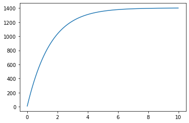
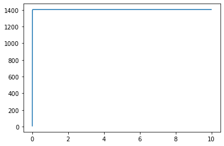
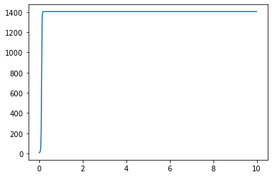
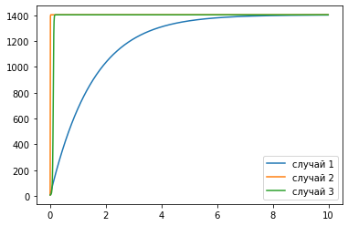

---
## Front matter
lang: ru-RU
title: Лабораторная работа №7
author: |
	Левкович К.А. - студент группы НКНбд-01-18
date: 20.03.2021

## Formatting
toc: false
slide_level: 2
theme: metropolis
header-includes: 
 - \metroset{progressbar=frametitle,sectionpage=progressbar,numbering=fraction}
 - '\makeatletter'
 - '\beamer@ignorenonframefalse'
 - '\makeatother'
aspectratio: 43
section-titles: true
---

# Эффективность рекламы

## Цель выполнения лабораторной работы

- Рассмотреть модель эффективности рекламы в разных случаях.

## Задачи выполнения работы

- Познакомиться с моделью Мальтуса, а также с уравнением логистической кривой.

- Построить график распространения рекламы.

## Условия

Постройте график распространения рекламы, математическая модель которой описывается следующим уравнением:

1. $\frac{\partial n}{\partial t} = (0.64 + 0.00004n(t))(N - n(t))$
2. $\frac{\partial n}{\partial t} = (0.00007 + 0.7n(t))(N - n(t))$
3. $\frac{\partial n}{\partial t} = (0.4 + 0.3sin(2t)n(t))(N - n(t))$

При этом объем аудитории $N$ = 1403, в начальный момент о товаре знает 9 человек.
Для случая 2 определите в какой момент времени скорость распространения рекламы будет иметь максимальное значение.

## Теория

- $\frac{\partial n}{\partial t}$ — скорость изменения со временем числа потребителей, узнавших о товаре и готовых его купить;
- $t$ — время, прошедшее с начала рекламной кампании;
- $n(t)$ — число уже информированных клиентов. Эта величина пропорциональна числу покупателей, еще не знающих о нем. Это описывается следующим образом: $$ \alpha_1(t)(N-n(t)) $$

## Теория

- $N$ — общее число потенциальных платежеспособных покупателей
- $\alpha_1(t)>0$ — характеризует интенсивность рекламной кампании (зависит от затрат на рекламу в данный момент времени).

## Теория

- $\alpha_2(t)n(t)(N-n(t))$ - вклад в рекламу за счет распространения информации потребителями среди покупателей.

## Теория

Математическая модель распространения рекламы описывается уравнением:

$$ \frac{\partial n}{\partial t} = (\alpha_1(t) + \alpha_2(t)n(t))(N - n(t))$$

## Графики

{ #fig:001 width=70% }

## Графики

{ #fig:002 width=70% }

## Графики

{ #fig:003 width=70% }

## Графики

{ #fig:004 width=70% }

## Выводы

- Познакомился с моделью Мальтуса, а также с уравнением логистической кривой.
- Рассмотрел модель эффективности рекламы в разных случаях, а также построил график распространения рекламы.