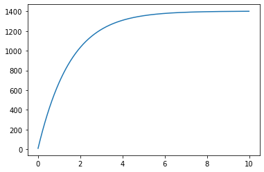
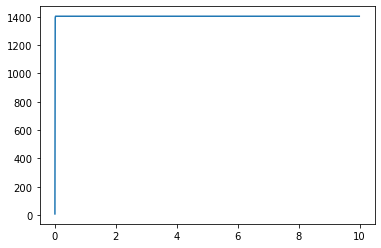
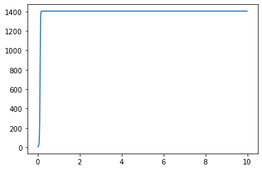
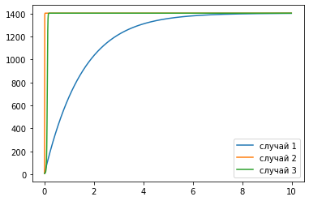

---
# Front matter
lang: ru-RU
title: "Лабораторная работа №7"
subtitle: "Эффективность рекламы"
author: "Левкович Константин Анатольевич"

# Formatting
toc-title: "Содержание"
toc: true # Table of contents
toc_depth: 2
lof: true # List of figures
fontsize: 12pt
linestretch: 1.5
papersize: a4paper
documentclass: scrreprt
polyglossia-lang: russian
polyglossia-otherlangs: english
mainfont: PT Serif
romanfont: PT Serif
sansfont: PT Sans
monofont: PT Mono
mainfontoptions: Ligatures=TeX
romanfontoptions: Ligatures=TeX
sansfontoptions: Ligatures=TeX,Scale=MatchLowercase
monofontoptions: Scale=MatchLowercase
indent: true
pdf-engine: lualatex
header-includes:
  - \linepenalty=10 # the penalty added to the badness of each line within a paragraph (no associated penalty node) Increasing the value makes tex try to have fewer lines in the paragraph.
  - \interlinepenalty=0 # value of the penalty (node) added after each line of a paragraph.
  - \hyphenpenalty=50 # the penalty for line breaking at an automatically inserted hyphen
  - \exhyphenpenalty=50 # the penalty for line breaking at an explicit hyphen
  - \binoppenalty=700 # the penalty for breaking a line at a binary operator
  - \relpenalty=500 # the penalty for breaking a line at a relation
  - \clubpenalty=150 # extra penalty for breaking after first line of a paragraph
  - \widowpenalty=150 # extra penalty for breaking before last line of a paragraph
  - \displaywidowpenalty=50 # extra penalty for breaking before last line before a display math
  - \brokenpenalty=100 # extra penalty for page breaking after a hyphenated line
  - \predisplaypenalty=10000 # penalty for breaking before a display
  - \postdisplaypenalty=0 # penalty for breaking after a display
  - \floatingpenalty = 20000 # penalty for splitting an insertion (can only be split footnote in standard LaTeX)
  - \raggedbottom # or \flushbottom
  - \usepackage{float} # keep figures where there are in the text
  - \floatplacement{figure}{H} # keep figures where there are in the text
---

# Цель работы

1. Познакомиться с моделью Мальтуса, а также с уравнением логистической кривой.

2. Рассмотреть модель эффективности рекламы в разных случаях.

3. Построить график распространения рекламы.

# Выполнение лабораторной работы

## Теоретическое введение

Организуется рекламная кампания нового товара или услуги. Необходимо, чтобы прибыль будущих продаж с избытком покрывала издержки на рекламу. Вначале расходы могут превышать прибыль, поскольку лишь малая часть потенциальных покупателей будет информирована о новинке. Затем, при увеличении числа продаж, возрастает и прибыль, и, наконец, наступит момент, когда рынок насытится, и рекламировать товар станет бесполезным.

Предположим, что торговыми учреждениями реализуется некоторая продукция, о которой в момент времени $t$ из числа потенциальных покупателей $N$ знает лишь $n$ покупателей. Для ускорения сбыта продукции запускается реклама по радио, телевидению и других средств массовой информации. После запуска рекламной кампании информация о продукции начнет распространяться среди потенциальных покупателей путем общения друг с другом. Таким образом, после запуска рекламных объявлений скорость изменения числа знающих о продукции людей пропорциональна как числу знающих о товаре покупателей, так и числу покупателей о нем не знающих.

Модель рекламной кампании описывается следующими величинами. Считаем, что

$\frac{\partial n}{\partial t}$ — скорость изменения со временем числа потребителей, узнавших о товаре и готовых его купить;

$t$ — время, прошедшее с начала рекламной кампании;

$n(t)$ — число уже информированных клиентов. Эта величина пропорциональна числу покупателей, еще не знающих о нем. Это описывается следующим образом:

$$ \alpha_1(t)(N-n(t)) $$

$N$ — общее число потенциальных платежеспособных покупателей

$\alpha_1(t)>0$ — характеризует интенсивность рекламной кампании (зависит от затрат на рекламу в данный момент времени).

Помимо этого, узнавшие о товаре потребители также распространяют полученную информацию среди потенциальных покупателей, не знающих о нем (в этом случае работает т.н. сарафанное радио). Этот вклад в рекламу описывается величиной

$$ \alpha_2(t)n(t)(N-n(t)) $$

эта величина увеличивается с увеличением потребителей узнавших о товаре. 

Математическая модель распространения рекламы описывается уравнением:

$$ \frac{\partial n}{\partial t} = (\alpha_1(t) + \alpha_2(t)n(t))(N - n(t))$$

## Задание

Постройте график распространения рекламы, математическая модель которой описывается следующим уравнением:

1. $\frac{\partial n}{\partial t} = (0.64 + 0.00004n(t))(N - n(t))$
2. $\frac{\partial n}{\partial t} = (0.00007 + 0.7n(t))(N - n(t))$
3. $\frac{\partial n}{\partial t} = (0.4 + 0.3sin(2t)n(t))(N - n(t))$

При этом объем аудитории $N$ = 1403, в начальный момент о товаре знает 9 человек.
Для случая 2 определите в какой момент времени скорость распространения рекламы будет иметь максимальное значение.

## Графики
Первый случай: $\alpha_1(t) = 0.64$, $\alpha_2(t) = 0.00004$.

$\alpha_1(t) > \alpha_2(t)$. (рис. -@fig:001)

{ #fig:001 width=70% }

Второй случай: $\alpha_1(t) = 0.00007$, $\alpha_2(t) = 0.7$. Cкорость распространения рекламы будет иметь максимальное значение в момент 0.01.

$\alpha_1(t) < \alpha_2(t)$. (рис. -@fig:002)

{ #fig:002 width=70% }

Третий случай: $\alpha_1(t) = 0.4$, $\alpha_2(t) = 0.3sin(2t)$. (рис. -@fig:003)

{ #fig:003 width=70% }

Все случаи вместе (рис. -@fig:004):

{ #fig:004 width=70% }

## Вопросы к лабораторной

### 1. Записать модель Мальтуса (дать пояснение, где используется данная модель)

Демографическая модель  
Скорость роста пропорциональна текущему размеру популяции
$$ \frac{\partial x}{\partial t} = {\alpha}x $$

где $x$ — исходная численность населения, ${\alpha}$ — некоторый параметр, определяемый разностью между рождаемостью и смертностью. $t$ — время.

### 2. Записать уравнение логистической кривой (дать пояснение, что описывает данное уравнение)

$$ \frac{\partial x}{\partial t} = {\alpha}(1 - \frac{x}{x_s})x $$

где ${x_s}$ - «равновесный» размер популяции, при котором рождаемость в точности компенсируется смертностью. Размер популяции в такой модели стремится к равновесному значению ${x_s}$, причем такое поведение структурно устойчиво.  
Данное уравнение описывает рождаемость и смертность с учетом роста численности.

### 3. На что влияет коэффициент $\alpha_1(t)$ и $\alpha_2(t)$ в модели распространения рекламы

$\alpha_1(t)$ — интенсивность рекламной кампании, зависящая от затрат

$\alpha_2(t)$ — интенсивность рекламной кампании, зависящая от сарафанного радио.

### 4. Как ведет себя рассматриваемая модель при $\alpha_1(t) \gg \alpha_2(t)$

При $\alpha_1(t) \gg \alpha_2(t)$ получается модель типа модели Мальтуса.

$$ \frac{\partial x}{\partial t} = {\alpha}x $$

### 5. Как ведет себя рассматриваемая модель при $\alpha_1(t) \ll \alpha_2(t)$

При $\alpha_1(t) \ll \alpha_2(t)$ получаем уравнение логистической кривой:

$$ \frac{\partial x}{\partial t} = {\alpha}(1 - \frac{x}{x_s})x $$

# Выводы

1. Познакомился с моделью Мальтуса, а также с уравнением логистической кривой.

2. Рассмотрел модель эффективности рекламы в разных случаях.

3. Построил график распространения рекламы.