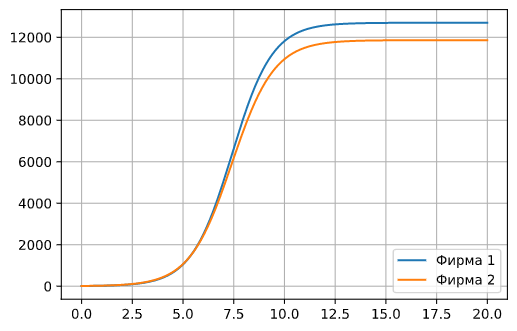
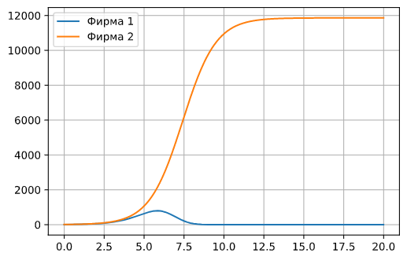

---
## Front matter
lang: ru-RU
title: Лабораторная работа №8
author: |
	Левкович К.А. - студент группы НКНбд-01-18
date: 03.04.2021

## Formatting
toc: false
slide_level: 2
theme: metropolis
header-includes: 
 - \metroset{progressbar=frametitle,sectionpage=progressbar,numbering=fraction}
 - '\makeatletter'
 - '\beamer@ignorenonframefalse'
 - '\makeatother'
aspectratio: 43
section-titles: true
---

# Модель конкуренции двух фирм

## Цель выполнения лабораторной работы

- Рассмотреть модель конкуренции двух фирм в разных случаях.

- Построить графики изменения оборотных средств фирм.

## Задачи выполнения работы

1. Построить графики изменения оборотных средств фирмы 1 и фирмы 2 без
учета постоянных издержек и с веденной нормировкой для случая 1.

2. Построить графики изменения оборотных средств фирмы 1 и фирмы 2 без
учета постоянных издержек и с веденной нормировкой для случая 2.

## Условия

1. $$\begin{cases} \frac{d M_1}{d \theta} = M_1 - \frac{b}{c_1} M_1 M_2 - \frac{a_1}{c_1} M_1^2 \\ \frac{d M_2}{d \theta} = \frac{c_2}{c_1} M_2 -\frac{b}{c_1} M_1 M_2 - \frac{a_2}{c_1} M_2^2 \end{cases}$$

2. $$\begin{cases} \frac{d M_1}{d \theta} = M_1 - (\frac{b}{c_1} + 0.00044) M_1 M_2 - \frac{a_1}{c_1} M_1^2 \\ \frac{d M_2}{d \theta} = \frac{c_2}{c_1} M_2 -\frac{b}{c_1} M_1 M_2 - \frac{a_2}{c_1} M_2^2 \end{cases}$$

## Условия

При этом начальные условия:  
$M_0^1 = 7.7$, $M_0^2 = 9.7$  
$p_{cr} = 47$, $N = 50$, $q = 1$,  
$\tau_1 = 33$, $\tau_2 = 27$  
$\tilde{p}_1 = 9.7$, $\tilde{p}_2 = 11.7$  

## Теория

- $N$ – число потребителей производимого продукта.  
- $\tau$ – длительность производственного цикла  
- $p$ – рыночная цена товара  

## Теория

- $p_{cr}$– себестоимость продукта, то есть переменные издержки на производство единицы продукции.  
- $q$ – максимальная потребность одного человека в продукте в единицу времени  
- $\theta = \frac{t}{c_1}$ - безразмерное время  

## Графики

{ #fig:001 width=70% }

## Графики

{ #fig:002 width=70% }

## Выводы

- Рассмотрел модель конкуренции двух фирм в разных случаях.

- Построил графики изменения оборотных средств фирм.