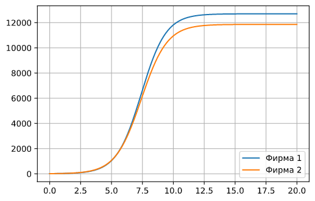

---
# Front matter
lang: ru-RU
title: "Лабораторная работа №8"
subtitle: "Модель конкуренции двух фирм"
author: "Левкович Константин Анатольевич"

# Formatting
toc-title: "Содержание"
toc: true # Table of contents
toc_depth: 2
lof: true # List of figures
fontsize: 12pt
linestretch: 1.5
papersize: a4paper
documentclass: scrreprt
polyglossia-lang: russian
polyglossia-otherlangs: english
mainfont: PT Serif
romanfont: PT Serif
sansfont: PT Sans
monofont: PT Mono
mainfontoptions: Ligatures=TeX
romanfontoptions: Ligatures=TeX
sansfontoptions: Ligatures=TeX,Scale=MatchLowercase
monofontoptions: Scale=MatchLowercase
indent: true
pdf-engine: lualatex
header-includes:
  - \linepenalty=10 # the penalty added to the badness of each line within a paragraph (no associated penalty node) Increasing the value makes tex try to have fewer lines in the paragraph.
  - \interlinepenalty=0 # value of the penalty (node) added after each line of a paragraph.
  - \hyphenpenalty=50 # the penalty for line breaking at an automatically inserted hyphen
  - \exhyphenpenalty=50 # the penalty for line breaking at an explicit hyphen
  - \binoppenalty=700 # the penalty for breaking a line at a binary operator
  - \relpenalty=500 # the penalty for breaking a line at a relation
  - \clubpenalty=150 # extra penalty for breaking after first line of a paragraph
  - \widowpenalty=150 # extra penalty for breaking before last line of a paragraph
  - \displaywidowpenalty=50 # extra penalty for breaking before last line before a display math
  - \brokenpenalty=100 # extra penalty for page breaking after a hyphenated line
  - \predisplaypenalty=10000 # penalty for breaking before a display
  - \postdisplaypenalty=0 # penalty for breaking after a display
  - \floatingpenalty = 20000 # penalty for splitting an insertion (can only be split footnote in standard LaTeX)
  - \raggedbottom # or \flushbottom
  - \usepackage{float} # keep figures where there are in the text
  - \floatplacement{figure}{H} # keep figures where there are in the text
---

# Цель работы

1. Рассмотреть модель конкуренции двух фирм в разных случаях.

2. Построить графики изменения оборотных средств фирм.

# Выполнение лабораторной работы

## Теоретическое введение

### Модель одной фирмы

&nbsp;&nbsp;&nbsp;&nbsp;&nbsp;&nbsp;Для построения модели конкуренции хотя бы двух фирм необходимо рассмотреть модель одной фирмы. Вначале рассмотрим модель фирмы,производящей продукт долговременного пользования, когда цена его определяется балансом спроса и предложения. Примем, что этот продукт занимает определенную нишу рынка и конкуренты в ней отсутствуют.

&nbsp;&nbsp;&nbsp;&nbsp;&nbsp;&nbsp;Обозначим:

$N$ – число потребителей производимого продукта.

$S$ – доходы потребителей данного продукта. Считаем, что доходы всех потребителей одинаковы. Это предположение справедливо, если речь идет об одной рыночной нише, т.е. производимый продукт ориентирован на определенный слой населения.

$M$ – оборотные средства предприятия

$\tau$ – длительность производственного цикла

$p$ – рыночная цена товара

$\tilde{p}$ – себестоимость продукта, то есть переменные издержки на производство единицы продукции.

$\delta$ – доля оборотных средств, идущая на покрытие переменных издержек.

$\kappa$ – постоянные издержки, которые не зависят от количества выпускаемой
продукции.

&nbsp;&nbsp;&nbsp;&nbsp;&nbsp;&nbsp;$Q(S/p)$ – функция спроса, зависящая от отношения дохода S к цене p. Она
равна количеству продукта, потребляемого одним потребителем в единицу
времени.

&nbsp;&nbsp;&nbsp;&nbsp;&nbsp;&nbsp;Функцию спроса товаров долговременного использования часто
представляют в простейшей форме:

$$Q = q - k \frac{P}{S} = q(1 - \frac{p}{p_{cr}}),$$

где $q$ – максимальная потребность одного человека в продукте в единицу времени. Эта функция падает с ростом цены и при p = pcr (критическая стоимость продукта)потребители отказываются от приобретения товара. Величина pcr = Sq/k. Параметр $k$ – мера эластичности функции спроса по цене. Таким образом, функция спроса в форме (1) является пороговой (то есть, $Q(S/p) = 0$ при $p \geq p_{cr}$) и обладает свойствами насыщения.

&nbsp;&nbsp;&nbsp;&nbsp;&nbsp;&nbsp;Уравнения динамики оборотных средств можно записать в виде

$$\frac{\partial M}{\partial t} = -\frac{M \delta}{\tau} + NQp - \kappa = -\frac{M \delta}{\tau} + NQ(1 - \frac{p}{p_{cr}})p - \kappa$$

&nbsp;&nbsp;&nbsp;&nbsp;&nbsp;&nbsp;Уравнение для рыночной цены p представим в виде

$$\frac{\partial p}{\partial t} = \gamma (-\frac{M \delta}{\tau \tilde{p}} + NQ(1 - \frac{p}{p_{cr}})$$

&nbsp;&nbsp;&nbsp;&nbsp;&nbsp;&nbsp;Первый член соответствует количеству поставляемого на рынок товара (то есть, предложению), а второй член – спросу.

&nbsp;&nbsp;&nbsp;&nbsp;&nbsp;&nbsp;Параметр $\gamma$ зависит от скорости оборота товаров на рынке. Как правило, время торгового оборота существенно меньше времени производственного цикла $\tau$. При заданном $M$ уравнение (3) описывает быстрое стремление цены к равновесному значению цены, которое устойчиво.

&nbsp;&nbsp;&nbsp;&nbsp;&nbsp;&nbsp;В этом случае уравнение (3) можно заменить алгебраическим соотношением

$$\frac{M \delta}{\tau \tilde{p}} + NQ(1 - \frac{p}{p_{cr}}) = 0$$

&nbsp;&nbsp;&nbsp;&nbsp;&nbsp;&nbsp;Из (4) следует, что равновесное значение цены p равно

$$p = p_{cr}(1 - \frac{M \delta}{\tau \tilde{p} Nq})$$

&nbsp;&nbsp;&nbsp;&nbsp;&nbsp;&nbsp;Уравнение (2) с учетом (5) приобретает вид

$$\frac{\partial M}{\partial t} = M \frac{\delta}{\tau}(\frac{p_{cr}}{\tilde{p}} - 1) - M^2 (\frac{\delta}{\tau \delta{p}})^2 \frac{p_{cr}}{Nq} - \kappa$$

&nbsp;&nbsp;&nbsp;&nbsp;&nbsp;&nbsp;Уравнение (6) имеет два стационарных решения, соответствующих условию $\partial M / \partial t$ = 0:

$$\tilde{M}_{1,2} = \frac{1}{2}a \pm \sqrt{\frac{a^2}{4} - b}$$

где

$$a = Nq(1 - \frac{\tilde{p}}{p_{cr}}) \tilde{p} \frac{\tau}{\delta}, b = \kappa Nq \frac{(\tau \tilde{p})^2}{p_{cr} \delta^2}$$

&nbsp;&nbsp;&nbsp;&nbsp;&nbsp;&nbsp;Из (7) следует, что при больших постоянных издержках (в случае $a^2 < 4b$) стационарных состояний нет. Это означает, что в этих условиях фирма не может функционировать стабильно, то есть, терпит банкротство. Однако, как правило, постоянные затраты малы по сравнению с переменными (то есть, $b \ll a^2$) и играют роль, только в случае, когда оборотные средства малы. При $b \ll a$ стационарные значения M равны

$$\tilde{M}_+ = Nq \frac{\tau}{\delta}(1 - \frac{\tilde{p}}{p_{cr}}) \tilde{p}, \tilde{M}_- = \kappa \tilde{p} \frac{\tau}{\delta(p_{cr} - \tilde{p})}$$

&nbsp;&nbsp;&nbsp;&nbsp;&nbsp;&nbsp;Первое состояние $\tilde{M}_+$ устойчиво и соответствует стабильному функционированию предприятия. Второе состояние $\tilde{M}_-$ неустойчиво, так что при $M < \tilde{M}_-$ оборотные средства падают ($\partial M / \partial t < 0$), то есть, фирма идет к банкротству. По смыслу $\tilde{M}_-$ соответствует начальному капиталу, необходимому для входа в рынок.

&nbsp;&nbsp;&nbsp;&nbsp;&nbsp;&nbsp;В обсуждаемой модели параметр $\delta$ всюду входит в сочетании с $\tau$. Это значит, что уменьшение доли оборотных средств, вкладываемых в производство, эквивалентно удлинению производственного цикла. Поэтому мы в дальнейшем положим: $\delta$ = 1, а параметр $\tau$ будем считать временем цикла, с учётом сказанного.

### Конкуренция двух фирм

&nbsp;&nbsp;&nbsp;&nbsp;&nbsp;&nbsp;Рассмотрим две фирмы, производящие взаимозаменяемые товары одинакового качества и находящиеся в одной рыночной нише. Последнее означает, что у потребителей в этой нише нет априорных предпочтений, и они приобретут тот или иной товар, не обращая внимания на знак фирмы.

&nbsp;&nbsp;&nbsp;&nbsp;&nbsp;&nbsp;В этом случае, на рынке устанавливается единая цена, которая определяется балансом суммарного предложения и спроса. Иными словами, в рамках нашей модели конкурентная борьба ведётся только рыночными методами. То есть, конкуренты могут влиять на противника путем изменения параметров своего производства: себестоимость, время цикла, но не могут прямо вмешиваться в ситуацию на рынке («назначать» цену или влиять на потребителей каким-либо иным способом.)

&nbsp;&nbsp;&nbsp;&nbsp;&nbsp;&nbsp;Уравнения динамики оборотных средств запишем по аналогии с (2) в виде

$$\begin{cases} \frac{\partial M_1}{\partial t} = - \frac{M_1}{\tau_1} + N_1q(1 - \frac{p}{p_{cr}})p - \kappa_1 \\ \frac{\partial M_2}{\partial t} = - \frac{M_2}{\tau_2} + N_2q(1 - \frac{p}{p_{cr}})p - \kappa_2 \end{cases}$$

где использованы те же обозначения, а индексы 1 и 2 относятся к первой и второй фирме, соответственно. Величины $N_1$ и $N_2$ – числа потребителей, приобретших товар первой и второй фирмы.

&nbsp;&nbsp;&nbsp;&nbsp;&nbsp;&nbsp;Учтем, что товарный баланс устанавливается быстро, то есть, произведенный каждой фирмой товар не накапливается, а реализуется по цене $p$. Тогда

$$\begin{cases} \frac{M_1}{\tau_1 \tilde{p}_1} = - N_1q(1 - \frac{p}{p_{cr}}) \\ \frac{M_2}{\tau_2 \tilde{p}_2} = - N_2q(1 - \frac{p}{p_{cr}}) \end{cases}$$

где $\tilde{p}_1$ и $\tilde{p}_2$ – себестоимости товаров в первой и второй фирме.

&nbsp;&nbsp;&nbsp;&nbsp;&nbsp;&nbsp;С учетом (10) представим (11) в виде

$$\begin{cases} \frac{\partial M_1}{\partial t} = - \frac{M_1}{\tau_1}(1 - \frac{p}{\tilde{p}_1}) - \kappa_1 \\ \frac{\partial M_2}{\partial t} = - \frac{M_2}{\tau_2}(1 - \frac{p}{\tilde{p}_2}) - \kappa_2 \end{cases}$$

&nbsp;&nbsp;&nbsp;&nbsp;&nbsp;&nbsp;Уравнение для цены, по аналогии с (3),

$$\frac{\partial p}{\partial t} = - \gamma (\frac{M_1}{\tau_1 \tilde{p}_1} + \frac{M_2}{\tau_2 \tilde{p}_2} - Nq (1 - \frac{p}{p_{cr}})$$

&nbsp;&nbsp;&nbsp;&nbsp;&nbsp;&nbsp;Считая, как и выше, что ценовое равновесие устанавливается быстро, получим:

$$p = p_{cr} (1 - \frac{1}{Nq} (\frac{M_1}{\tau_1 \tilde{p}_1} + \frac{M_2}{\tau_2 \tilde{p}_2}))$$

&nbsp;&nbsp;&nbsp;&nbsp;&nbsp;&nbsp;Подставив (14) в (12) имеем:

$$\begin{cases} \frac{\partial M_1}{\partial t} = c_1 M_1 - b M_1 M_2 - a_1 M_1^2 - \kappa_1 \\ \frac{\partial M_2}{\partial t} = c_2 M_2 - b M_1 M_2 - a_2 M_2^2 - \kappa_2 \end{cases}$$

где

$$a_1 = \frac{p_{cr}}{\tau_1^2 \tilde{p}_1^2 Nq}, a_2 = \frac{p_{cr}}{\tau_2^2 \tilde{p}_2^2 Nq}, b = \frac{p_{cr}}{\tau_1^2 \tilde{p}_1^2 \tau_2^2 \tilde{p}_2^2 Nq}, c_1 = \frac{p_{cr} - \tilde{p}_1}{\tau_1^2 \tilde{p}_1^2}, c_2 = \frac{p_{cr} - \tilde{p}_2}{\tau_2^2 \tilde{p}_2^2}$$

&nbsp;&nbsp;&nbsp;&nbsp;&nbsp;&nbsp;Исследуем систему (15) в случае, когда постоянные издержки ($κ_1, κ_2$) пренебрежимо малы. И введем нормировку $t = c_1 \theta$. Получим следующую систему:

$$\begin{cases} \frac{\partial M_1}{\partial \theta} = M_1 - \frac{b}{c_1} M_1 M_2 - \frac{a_1}{c_1} M_1^2 \\ \frac{\partial M_2}{\partial \theta} = \frac{c_2}{c_1} M_2 -\frac{b}{c_1} M_1 M_2 - \frac{a_2}{c_1} M_2^2 \end{cases}$$

## Задание

&nbsp;&nbsp;&nbsp;&nbsp;&nbsp;&nbsp;<b>Случай 1</b>. Рассмотрим две фирмы, производящие взаимозаменяемые товары одинакового качества и находящиеся в одной рыночной нише. Считаем, что в рамках нашей модели конкурентная борьба ведётся только рыночными методами. То есть, конкуренты могут влиять на противника путем изменения параметров своего производства: себестоимость, время цикла, но не могут прямо вмешиваться в ситуацию на рынке («назначать» цену или влиять на потребителей каким-либо иным способом.) Будем считать, что постоянные издержки пренебрежимо малы, и в модели учитывать не будем. В этом случае динамика изменения объемов продаж фирмы 1 и фирмы 2 описывается следующей системой уравнений:

$$\begin{cases} \frac{d M_1}{d \theta} = M_1 - \frac{b}{c_1} M_1 M_2 - \frac{a_1}{c_1} M_1^2 \\ \frac{d M_2}{d \theta} = \frac{c_2}{c_1} M_2 -\frac{b}{c_1} M_1 M_2 - \frac{a_2}{c_1} M_2^2 \end{cases}$$

&nbsp;&nbsp;&nbsp;&nbsp;&nbsp;&nbsp;<b>Случай 2</b>. Рассмотрим модель, когда, помимо экономического фактора влияния (изменение себестоимости, производственного цикла, использование кредита и т.п.), используются еще и социально-психологические факторы – формирование общественного предпочтения одного товара другому, не зависимо от их качества и цены. В этом случае взаимодействие двух фирм будет зависеть друг от друга, соответственно коэффициент перед $M_1M_2$ будет отличаться. Пусть в рамках рассматриваемой модели динамика изменения объемов продаж фирмы 1 и фирмы 2 описывается следующей системой уравнений:

$$\begin{cases} \frac{d M_1}{d \theta} = M_1 - (\frac{b}{c_1} + 0.00044) M_1 M_2 - \frac{a_1}{c_1} M_1^2 \\ \frac{d M_2}{d \theta} = \frac{c_2}{c_1} M_2 -\frac{b}{c_1} M_1 M_2 - \frac{a_2}{c_1} M_2^2 \end{cases}$$

Для обоих случаев рассмотрим задачу со следующими начальными условиями и параметрами:  
$M_0^1 = 7.7$, $M_0^2 = 9.7$  
$p_{cr} = 47$, $N = 50$, $q = 1$,  
$\tau_1 = 33$, $\tau_2 = 27$  
$\tilde{p}_1 = 9.7$, $\tilde{p}_2 = 11.7$  

<b>Обозначения:</b>  
$N$ – число потребителей производимого продукта.  
$\tau$ – длительность производственного цикла  
$p$ – рыночная цена товара  
$p_{cr}$– себестоимость продукта, то есть переменные издержки на производство единицы продукции.  
$q$ – максимальная потребность одного человека в продукте в единицу времени  
$\theta = \frac{t}{c_1}$ - безразмерное время  

## Графики

Первый случай. (рис. -@fig:001)

{ #fig:001 width=70% }

&nbsp;&nbsp;&nbsp;&nbsp;&nbsp;&nbsp;По графику видно, что рост оборотных средств предприятий идет независимо друг от друга. В математической модели (17) этот факт отражается в коэффициенте, стоящим перед членом $M_1 M_2$: в рассматриваемой задаче он одинаковый в обоих уравнениях ($\frac{b}{c_1}$. Это было обозначено в условиях задачи.

Каждая фирма достигает свое максимальное значение объема продаж и остается на рынке с этим значением, то есть каждая фирма захватывает свою часть рынка потребителей, которая не изменяется. 

Второй случай. (рис. -@fig:002)

{ #fig:002 width=70% }

По графику видно, что первая фирма, несмотря на начальный рост, достигнув своего максимального объема продаж, начитает нести убытки и, в итоге, терпит банкротство. Динамика роста объемов оборотных средств второй фирмы остается без изменения: достигнув максимального значения, остается на этом уровне. 

# Выводы

1. Рассмотрел модель конкуренции двух фирм в разных случаях.

2. Построил графики изменения оборотных средств фирм.